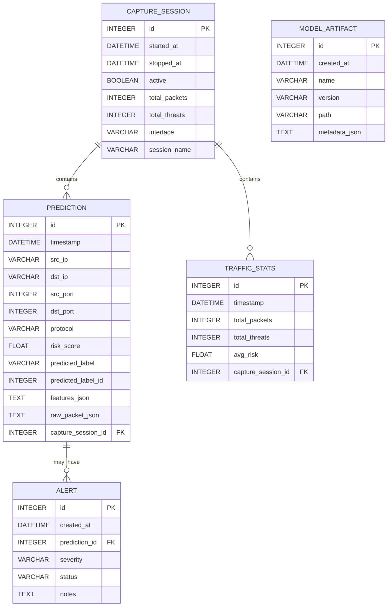

# Database ERD — SentinelX

This document contains the Entity-Relationship Diagram (ERD) and schema notes for the SentinelX project.

**Schema notes**
- Table: `PREDICTION`
  - Purpose: store per-packet (or per-aggregate) inference results and raw/derived features.
  - Important fields:
    - `timestamp` — event time (use UTC)
    - `features_json` — JSON(B) blob with feature vector (keyed by feature name)
    - `raw_packet_json` — optional packet payload/headers for debugging (truncate or redact PII)
    - `predicted_label_id` — integer index matching `target_encoder` mapping in ML artifacts
  - Indexes: `(timestamp)`, `(predicted_label_id)`, `(src_ip)`, `(dst_ip)`; consider composite index `(timestamp, predicted_label_id)` for time-window queries.

- Table: `TRAFFIC_STATS`
  - Purpose: periodically aggregated stats (e.g., per-minute) for charts and quick metrics.
  - Generated by DB worker at fixed intervals (e.g., 1m) or on-demand.
  - Indexes: `(timestamp)`.

- Table: `CAPTURE_SESSION`
  - Purpose: record live-capture sessions (start/stop metadata) and link predictions/stats to sessions.
  - Useful for auditing and retention (drop old sessions and related rows).

- Table: `ALERT`
  - Purpose: user/automated alerts created from `PREDICTION` rows (e.g., high-risk detections).
  - Fields `severity` (LOW/MED/HIGH), `status` (OPEN/ACKNOWLEDGED/CLOSED), `notes`.

- Table: `MODEL_ARTIFACT`
  - Purpose: versioned reference to model artifacts (path, version, metadata) so the pipeline can record which model produced predictions.

**Implementation recommendations**
- DB Engine:
  - Development: `sqlite:///./sentinelx.db` (current default).
  - Production: Postgres; use `JSONB` for `features_json` and `metadata_json`.
- Types and storage:
  - Store JSON blobs as `JSON`/`JSONB` when using Postgres to allow indexed queries (GIN) on certain keys (e.g., `features_json->>'protocol'`).
  - Keep `raw_packet_json` truncated or encrypted if it contains sensitive payloads.
- Retention & partitioning:
  - Retain `PREDICTION` rows for 90 days by default; use partitioning by `timestamp` for high-volume deployments.
  - Offload long-term storage of raw packets to object storage and keep only references in DB.
- Indexing & performance:
  - Add GIN index on `features_json` if you need to query feature contents.
  - Add partial indexes for high-risk predictions: `CREATE INDEX idx_pred_highrisk ON prediction (timestamp) WHERE risk_score >= 0.8;`
- Migration notes:
  - Alembic is already scaffolded in `Backend/db/alembic/`. Ensure model changes are reflected with `alembic revision --autogenerate -m "..."`.

**ERD mapping to current SQLAlchemy models**
- See `Backend/db/models.py` for current `Prediction` and `TrafficStats` models. Consider adding `CaptureSession`, `Alert`, and `ModelArtifact` as new models to support the UI features described below.

**Retention and maintenance**
- Schedule a periodic job (cron or DB job) to archive/delete old `PREDICTION` rows.
- Regularly snapshot `MODEL_ARTIFACT` table and store artifacts in a versioned object store (S3, GCS).

---
Generated: 2026-06-03
