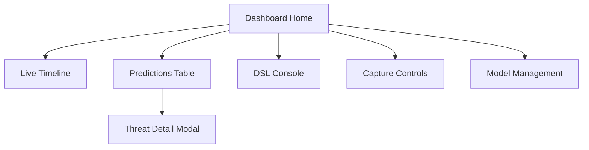

# UI Wireframes / Mockups — SentinelX

This document contains low-fidelity wireframes and a proposed layout for the Streamlit dashboard and related UI screens.

## Overview
Screens covered:
- Dashboard (Home)
- Live Traffic / Timeline
- Predictions Table
- Threat Detail (modal)
- DSL Console / REPL
- Capture Controls & Session panel
- Settings / Model Management

### Global layout (Streamlit)
- Left column: Capture controls, Pipeline status, DSL quick commands
- Main column: Top metrics + timeline chart, below: Predictions table and detail panel
- Right column (optional): Live packet inspector, quick filters, top talkers



## Screen: Dashboard Home
- Header: project name, `Start/Stop Capture` button, current `capture_session` badge
- KPI row: `Total packets`, `Total threats`, `Avg risk`, `Packets/sec`
- Live timeline: area chart (packets vs threats)
- Pipeline Status: table with pipeline stages and status strings
- Quick DSL input: single-line command + "Run" button

Mockup (ASCII):

[Header: SentinelX] [Start Capture] [Stop Capture] [Session: active]

KPI: | Packets: 11,586 | Threats: 452 | Avg Risk: 0.62 |

[Live timeline chart]

[Predictions table (paginated) | Search | Filters]

## Screen: Predictions Table
Columns:
- Timestamp | Src IP | Src Port | Dst IP | Dst Port | Protocol | Predicted | Risk | Actions
- Actions: `View` (opens Threat Detail), `Ack` (creates Alert), `Export`

## Screen: Threat Detail (modal)
Sections:
- Summary: timestamp, src/dst, predicted label, risk score, model version
- Feature vector: collapsible JSON view (key → value)
- Raw packet: truncated headers/payload (with redact toggle)
- Buttons: `Create Alert`, `Export PCAP`, `Close`

## Screen: DSL Console / REPL
- Input box (multi-line) with history
- Run button and example commands dropdown
- Output panel: table or rendered text (from DSL engine)

Example quick commands dropdown:
- `SHOW_THREATS LIMIT 20`
- `TOP_ATTACKERS LIMIT 10`
- `COUNT_PACKETS`

## Screen: Capture Controls & Session
- Interface selector (dropdown)
- Start / Stop / Restart capture buttons
- Session timeline: started_at, elapsed, packets captured
- Retention policy selector: `Store raw packets` toggle

## Screen: Model Management (Settings)
- Current model: version, created_at
- Button: `Rollback` / `Upload new model`
- Model artifacts table (from `MODEL_ARTIFACT` table)

---

### Quick Streamlit layout snippet (example)

```python
import streamlit as st
st.sidebar.header("Capture")
if st.sidebar.button("Start Capture"):
    # call API
    pass
st.header("SentinelX")
col1, col2 = st.columns([3,1])
with col1:
    st.line_chart([])  # timeline
    st.dataframe([])  # predictions
with col2:
    st.write("Pipeline status")
    st.text_area("DSL", height=120)
```

---
Generated: 2026-06-03
